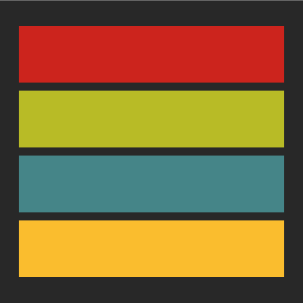
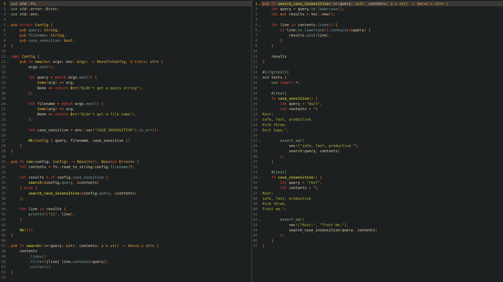
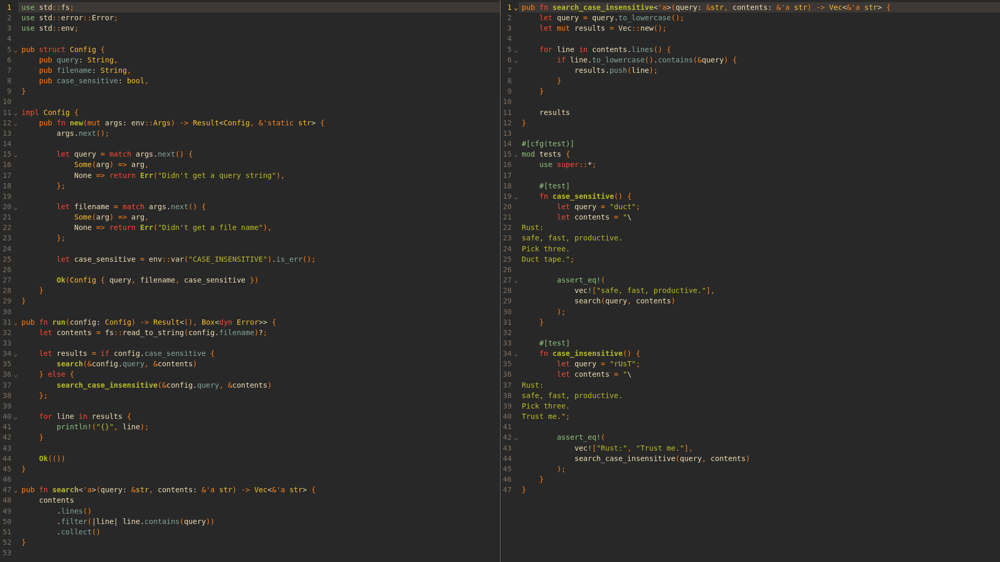
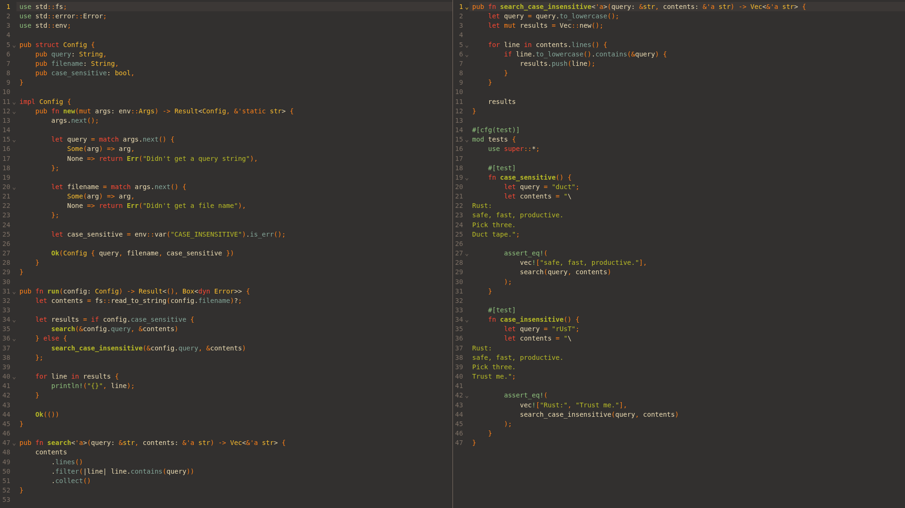
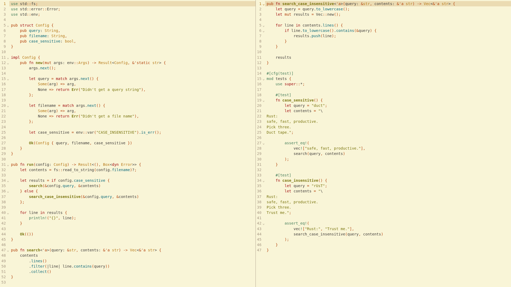
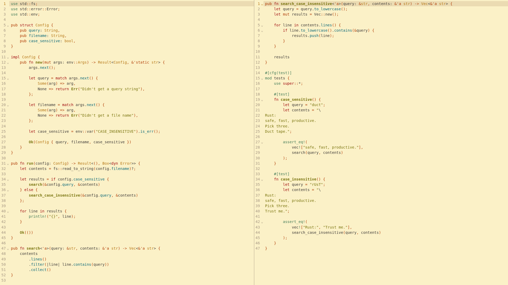
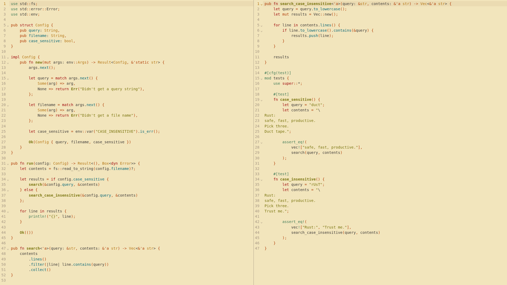

<h2 align="center">Gruvbox CodeMirror Color Theme</h2>

<div align="center">
  
</div>

A port of the retro groove Gruvbox color theme, including both flavors `Dark` and `Light`, each in three contrasts: `Hard`, medium (default) and `Soft`.

<div align="center">
  <h3>Dark Hard</h3>
  
</div>

<div align="center">
  <h3>Dark</h3>
  
</div>

<div align="center">
  <h3>Dark Soft</h3>
  
</div>

<div align="center">
  <h3>Light Hard</h3>
  
</div>

<div align="center">
  <h3>Light</h3>
  
</div>

<div align="center">
  <h3>Light Soft</h3>
  
</div>

## API and usage

Both flavors expose the same API, with `Hard` and `Soft` variants alongside the default medium contrast. Only the editor background (and the panel color derived from it) changes between contrasts; the highlight style is shared.

### Enable both the editor theme and the highlight style

```ts
gruvboxDarkHard: Extension;
gruvboxDark: Extension;
gruvboxDarkSoft: Extension;
gruvboxLightHard: Extension;
gruvboxLight: Extension;
gruvboxLightSoft: Extension;
```

```js
import { gruvboxDark } from 'gruvbox-codemirror-theme';

new EditorView({
  state: EditorState.create({
    extensions: [gruvboxDark, ...]
    ...
  });
  ...
});
```

### Enable just the editor theme:

```ts
gruvboxDarkHardTheme: Extension;
gruvboxDarkTheme: Extension;
gruvboxDarkSoftTheme: Extension;
gruvboxLightHardTheme: Extension;
gruvboxLightTheme: Extension;
gruvboxLightSoftTheme: Extension;
```

```js
import { gruvboxDarkTheme } from 'gruvbox-codemirror-theme';

new EditorView({
  state: EditorState.create({
    extensions: [gruvboxDarkTheme, ...]
    ...
  });
  ...
});
```

### Enable just the highlight style:

```ts
gruvboxDarkHighlightStyle: HighlightStyle;
gruvboxLightHighlightStyle: HighlightStyle;
```

```js
import { syntaxHighlighting } from "@codemirror/language";
import { gruvboxDarkHighlightStyle } from 'gruvbox-codemirror-theme';

new EditorView({
  state: EditorState.create({
    extensions: [syntaxHighlighting(gruvboxDarkHighlightStyle), ...]
    ...
  });
  ...
});
```

Credits to [morhetz](https://github.com/morhetz/gruvbox) for the original Vim theme and [ellisonleao](https://github.com/ellisonleao/gruvbox.nvim) for the Neovim port.

## License

This project is licensed under the MIT License - see the [LICENSE](LICENSE) file for details.
